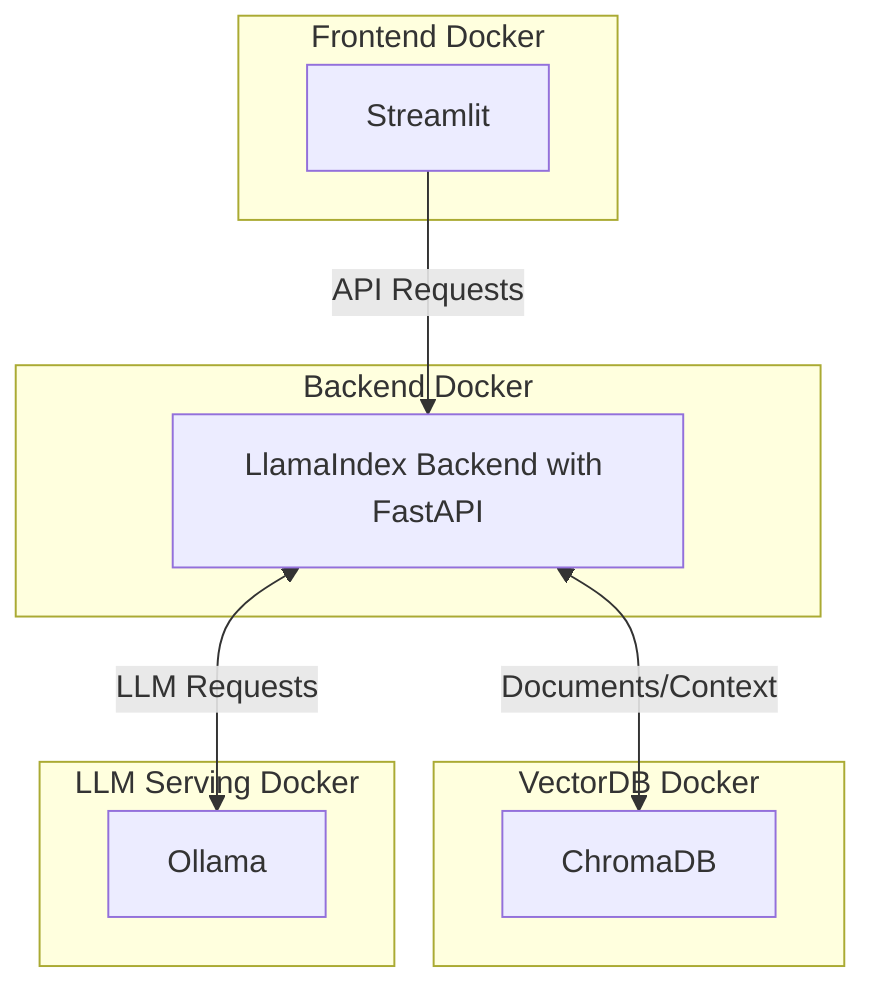

# PDF RAG System

A robust Retrieval-Augmented Generation (RAG) system for querying PDF documents using LLMs and vector storage. Built with FastAPI, Streamlit, ChromaDB, Ollama and LlamaIndex.
Refer to [Notes](Notes.md) for additional notes on this implementation.



## 🌟 Features

- 📄 PDF Document Processing
  - Automatic text extraction
  - Batch processing support
  - Document validation
  - Progress tracking

- 🔍 Query Engine
  - Semantic search using ChromaDB
  - Source attribution
  - Context-aware responses
  - Local LLM integration via Ollama

- 🎯 User Interface
  - Modern Streamlit frontend
  - Real-time status updates
  - Document management
  - Chat history with sources

- 🛠 System Architecture
  - Dockerized microservices
  - FastAPI backend
  - ChromaDB vector store
  - Scalable design

## 🚀 Quick Start

### Prerequisites
- Docker and Docker Compose
- Python 3.10+
- Ollama with a compatible LLM model

### Installation

1. Clone the repository:
```bash
git clone https://github.com/Anand-B09/rag
cd rag
```
2. Update Makefile and build
```bash
vi Makefile
# Update the DOCKER_COMPOSE variable based on your docker compose version
make build
```   
   
3. Start the services:
```bash
make up
```

4. Monitor Logs
```bash
make logs
```
  
5. Access the UI:
- Frontend: http://localhost:8501
- Backend API: http://localhost:8001
- ChromaDB: http://localhost:8000

6. Stop the services:
```bash
make down
```
   
## 📚 Project Structure

```
rag/
├── backend/             # FastAPI backend service
│   ├── app.py          # Main application
│   └── Dockerfile
├── frontend/           # Streamlit frontend
│   ├── streamlit_app.py # UI application
│   └── Dockerfile
├── tests/             # Test suite
└── docker-compose.yml
└── Notes.md            # Implementation Notes
```

## 🧪 Testing

The project does not come with a comprehensive test coverage:

```bash
# Install test dependencies
make install-test

# Run specific test suites
make test-unit

```


## 🔧 Development

1. Set up development environment:
```bash
# Install dependencies
pip install -r frontend/requirements.txt
pip install -r backend/requirements.txt
pip install -r tests/requirements-test.txt

# Start services in development mode
make up
```

## 🔍 API Documentation

### Backend API

#### Document Management
- `POST /upload`: Upload PDF documents
- `GET /documents`: List processed documents
- `DELETE /documents/{id}`: Remove a document

#### Query Engine
- `POST /query`: Query documents
  ```json
  {
    "query": "What is the main topic?",
    "options": {
      "limit": 5,
      "threshold": 0.7
    }
  }
  ```

#### System
- `GET /health`: System health check
- `GET /metrics`: System metrics

## 🎯 Features in Detail

### Document Processing
- Automatic text extraction from PDFs
- Document validation and sanitization
- Batch processing with progress tracking
- Error handling and retry logic

### Vector Storage
- ChromaDB for efficient vector storage
- Automatic embedding generation
- Similarity search optimization
- Metadata management

### Query Processing
- Context-aware response generation
- Source document attribution
- Relevance scoring
- Rate limiting and caching

## 📈 Performance

### Scalability
- Containerized architecture
- Independent scaling of components
- Batch processing for large documents
- Connection pooling and caching

### Limitations
- Maximum file size: 50MB
- Concurrent uploads: 5
- Rate limit: 10 requests/minute
- Maximum query length: 1000 characters

## 🛠 Configuration

### Environment Variables
```bash
# Backend
CHROMA_HOST=chroma
CHROMA_PORT=8000
MAX_UPLOAD_SIZE=10485760
RATE_LIMIT=10

# Frontend
BACKEND_URL=http://backend:8000
CHAT_HISTORY_LIMIT=50
```

### Docker Configuration
See `docker-compose.yml` for service configuration and networking.

## 🙏 Acknowledgments

- LlamaIndex for document processing
- ChromaDB for vector storage
- FastAPI for the backend framework
- Streamlit for the frontend interface
- Ollama for LLM serving

## Foot Notes

